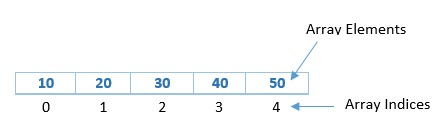
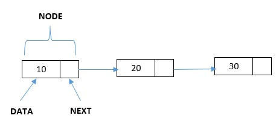
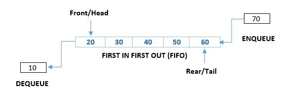
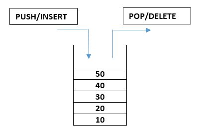
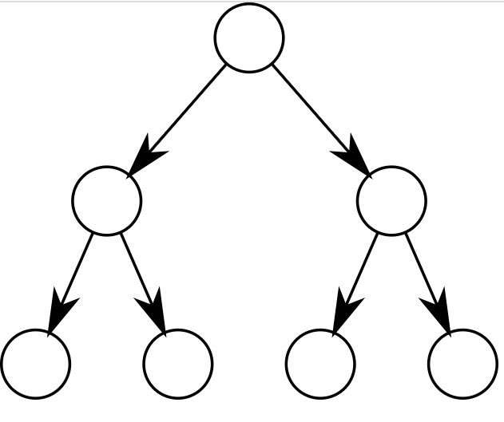
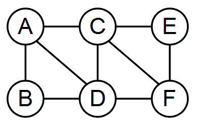
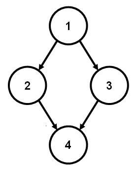

### Types of Data Structure

A data structure is a way of organizing, storing, and manipulating data in a computer so that it can be efficiently used and retrieved. Data structures can be classified into two categories: Primitive and Non-Primitive.

### Primitive Data Structures

- These are the most basic and fundamental data structures, such as integers, floats, and Booleans, that are directly built into a programming language. They have a clear and straightforward representation and are functionally constrained.

Here are a few points about Primitive Data Structures:

1. Basic: Primitive data structures are the most basic and fundamental data structures that are directly built into a programming language.

2. Simple Representation: They have a simple and straightforward representation, such as integers, floating-point numbers, and Booleans.

3. Limited Functionality: Primitive data structures are limited in their functionality and can only store and manipulate simple data.

4. Built-in Types: Primitive data structures are typically built-in types in most programming languages and do not require any special implementation.

5. Fast Access: Primitive data structures are stored in contiguous memory locations, which allows for fast access to their elements.

6. Efficient Storage: Since primitive data structures have a simple representation, they use less memory compared to non-primitive data structures.

7. Commonly used: Primitive data structures are commonly used in programming to store basic information and are used as building blocks for more complex data structures.

### Non Primitive Data Structures

- These are more advanced and complex data structures that are built using primitive data structures. Arrays, linked lists, trees, graphs, and hash tables are some examples. They offer more advanced functionality and allow us to use the efficient storing and manipulation of large volumes of data. They are used to handle complex problems that primitive data structures alone cannot solve.

Here are a few points about Non-Primitive Data Structures:

1. Complex: Non-primitive data structures are more complex and sophisticated data structures that are built using primitive data structures.

2. Advanced Functionality: They provide more advanced functionality and enable the efficient storage and manipulation of large amounts of data.

3. Used to solve complex problems: Non-primitive data structures are used to solve complex problems that cannot be solved using primitive data structures alone.

4. Dynamic: Non-primitive data structures can grow or shrink in size during runtime, whereas primitive data structures have a fixed size.

5. More Memory: Non-primitive data structures use more memory compared to primitive data structures due to their complex representation.

6. Higher Abstraction: Non-primitive data structures provide a higher level of abstraction compared to primitive data structures and hide the underlying implementation details.

7. Efficient Access: Non-primitive data structures are designed to provide efficient access to elements based on the problem they are used to solve.

- Non-Primitive Data Structures are more complex data structures built using primitive data structures. Examples of Non-Primitive Data Structures can be divided into two categories: Linear and Non-Linear.

1. Linear Data Structures: These data structures are organized in a linear or sequential manner. Examples include: Array,Linked List, Queue,Stack

2. Non-Linear Data Structures: These data structures are not organized in a sequential or linear manner. Examples include: Trees and Graphs

## Types of Linear Data Structures

#### Arrays

An Array is a collection of elements of the same data type stored in contiguous memory locations. It is a linear data structure that provides efficient access to its elements based on their indices. Each element in an array is referred to by its index, which is an integer that starts from 0. The elements are stored in a contiguous block of memory, which allows for fast access to elements based on their indices.

Array data structures have many applications, including:

1. Storing collections of data, such as lists of items or numbers

2. Implementing mathematical objects such as matrices and vectors

3. Implementing dynamic data structures such as stacks, queues, and hash tables

4. Imlementing tables, databases, and look-up tables

5. Implementing trees and graphs

6. Image processing and computer graphics

7. Representing strings and text data

8. Performing numerical computations and simulations.

#### Linked List

A linked list is a data structure consisting of a sequence of nodes, where each node holds data and a reference (link) to the next node in the sequence. The reference is stored in a field called "next". The last node in the list contains a null reference indicating the end of the list.

There are two main types of linked lists: singly linked lists and doubly linked lists. In a singly linked list, each node only has a reference to the next node in the list, while in a doubly linked list, each node has a reference to both the next node and the previous node.

A linked list has the following advantages over an array:

1. Dynamic size: Linked lists can grow or shrink in size during execution of a program, while the size of an array needs to be fixed when it is declared.

2. Ease of insertion and deletion: Inserting or deleting an element in a linked list is easier compared to arrays, as elements in linked lists do not need to be shifted.

3. No wastage of space: In arrays, unused space is wasted, while in linked lists, space is used only as needed.

On the other hand, linked lists have some disadvantages, such as slow random access time and higher overhead compared to arrays due to the extra memory required to store the links.

Linked lists are commonly used for dynamic data structures such as stacks, queues, and associative arrays. They can also be used for implementing trees, graphs, and other complex data structures.

#### Queue

A queue is a type of linear data structure that operates on the First In First Out (FIFO) principle. That is, the first item put to the queue will be the first to be removed. The last item added to the queue will be removed at last.

A queue performs two important operations:

1. Enqueue: Adds an item to the queue's end . ( Rear or Tail ) من الآخر
2. Dequeue: The act of removing an item from the front of a queue . ( Front or Head ) من الأول

An array or a linked list can be used to implement a queue. The implementation used is determined by the specific use case and needs.

Queues are widely used in a variety of algorithms and real-world applications, including:

1. Task scheduling in operating systems.
2. Message queue in communication systems.
3. Print spooler in printers.
4. BFS in graph algorithms.

#### Stack

A stack is a linear data structure that follows the Last-In-First-Out (LIFO) principle. It means the last element added to the stack will be the first one to be removed.

In computer science, a stack can be implemented using an array or linked list data structure. Some of the common operations performed on a stack include push (add an element to the top of the stack), pop (remove the top element from the stack), and peek (return the top element of the stack without removing it).

## Non-Linear Data Structurtes

These data structures are not organized in a sequential or linear manner. Examples include: Trees and Graphs

#### Trees

A tree is a hierarchical data structure that consists of nodes connected by edges. It is a non-linear data structure that represents a parent-child relationship between nodes.

A tree has a root node, which is the topmost node and has no parent. Each node in the tree can have zero or more child nodes. A node with no children is called a leaf node. The depth of a node is the number of edges from the root node to that node. The height of the tree is the maximum depth of any node in the tree.

Trees have several applications in computer science, including:

- Representing hierarchical relationships, such as the file system on a computer.

- Storing data in a way that allows efficient search and retrieval, such as binary search trees.
  Representing a graph data structure.

Examples of tree data structures:

- File system directory structure
- Expression tree
- Decision tree in machine learning
- Trie in computer science
- Huffman coding tree in data compression algorithms.

In computer science, a tree can be implemented using an array or linked list data structure. Some of the common operations performed on a tree include insertion, deletion, searching, and traversal (visiting all nodes in the tree).

#### Graph

A graph is a mathematical structure used to model relationships between objects. It consists of a set of vertices (also known as nodes) and a set of edges, which connect pairs of vertices. The vertices represent the objects, and the edges represent the relationships between the objects.

Note that graphs can be either directed or undirected, depending on whether the relationships represented by the edges have a direction. In a directed graph, the edges have a direction and are called arcs, while in an undirected graph, the edges have no direction and are simply called edges.

###### Undirected Graph

###### Directed Graph

Graphs can be used to model many different types of relationships, including social networks, transportation networks, and relationships between web pages.

Examples of graphs:

- Social network graph - vertices represent individuals, edges represent connections (e.g., friendship) between individuals.

- Road network graph - vertices represent intersections or locations, edges represent roads connecting the locations.

- Internet graph - vertices represent web pages, edges represent hyperlinks between web pages.
  Graph of flight routes - vertices represent airports, edges represent direct flights between airports.

### resources

[techskillguru](https://techskillguru.com/ds/types-of-data-structure)
