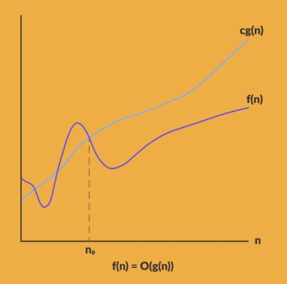
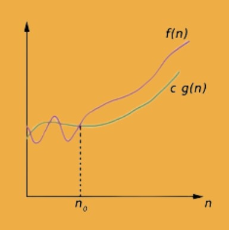
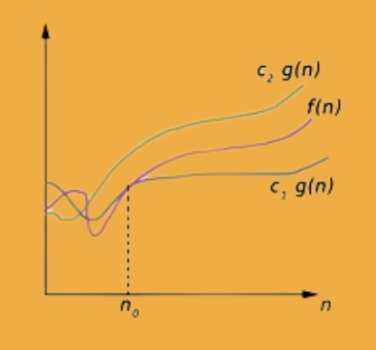

## What is Algorithm Complexity?

Algorithm complexity refers to the number of steps an algorithm needs to take in order to solve a particular problem. When given an input of size n, an algorithm's complexity is determined by how long it would take to complete a particular problem. If an algorithm needs to scale, even for very large values of n, it should still be able to compute the result in a finite and reasonable amount of time. Because of this, complexity is estimated asymptotically as n gets closer to infinity. While complexity is typically measured in terms of time, it can also be measured in terms of space, or more specifically, in terms of the amount of memory used by the algorithm.

### Examples to Understand Algorithm Complexity

- If there is a big, unsorted list and you are seeking for a certain item, you will likely compare each item. Search time is proportional to the list size. In this case, complexity is linear.

- On the other hand, searching for a word in a dictionary will be quicker since the words are arranged in order, you are aware of the order, and you can quickly determine whether you need to turn to earlier or later pages. This is an illustration of logarithmic complexity.

- No matter how many words there are in the dictionary, selecting the first word from it always takes a Constant amount of time. The complexity of joining the end of a bank queue is also constant regardless of how lengthy the queue is.This is an illustration of constant complexity.

- The difficulty increases quadratically if you are requested to find all duplicates in an unsorted list. It is linearly complex to search for duplicates of a single item. If we apply this rule to every item, complexity takes a quadratic form.

### What is the time space trade off?

A space-time tradeoff is a strategy used in computer science to either solve a problem or calculation quickly by using more storage space, or slowly and carefully by using very little space.

An algorithm or software in this situation trades off more space usage for less time. Thus, space refers to the amount of data storage used (RAM, HDD, etc.) and time refers to the amount of time used to complete a certain activity (computation time or response time)

Need of Time Space Tradeoff
Less time by using more memory
Solving a problem in very little space by spending a long time.

## Asymptotic Analysis

Asymptotic notations are mathematical notations for analysing the runtime of a given algorithm for a large input. It allows us to compare the runtimes of various algorithms without having to manually calculate their runtimes. We must determine how long our algorithm takes to complete each step in order to evaluate how well it performs for various inputs. This time can easily be calculated by manually. Sometimes it's not possible for humans to record such a small runtime, so manually measuring an algorithm's runtime is not a smart idea.

- <u>Asymptotic notation</u> is a mathematical notation that is used to analyze the time complexity and the runtime of an algorithm for a large input.

An algorithm's asymptotic analysis involves determining the mathematical limits or framing of its run-time performance. We may easily draw conclusions about an algorithm's best case, average case, and worst case scenarios using asymptotic analysis.

An algorithm's time requirement often falls into one of three categories.

- Best Case − Minimum time required for program execution.
- Average Case − Average time required for program execution.
- Worst Case − Maximum time required for program execution.

* Big Oh (Ο) Notation (Worst Case)
* Big-Omega (Ω) Notation (Best Case)
* Big-Theta(Θ) Notation (Average Case)

1. Big Oh (O) Notation

The formal notation for expressing the upper bound of an algorithm's execution time is O(n). It calculates the worst-case time complexity, or the maximum time an algorithm can take to run.

Think about the f(n) and g(n) functions, where f and g are defined on an unbounded set of positive real numbers. For every big value of n, g(n) is always strictly positive.

The function f is said to be O(g) (read as big- oh of g), if, for a constant c>0 and a natural number n0, f (n) ≤ CG(n) for all n >= n0. This can bw written as below

O(g(n)) = { f(n) : There exist positive constant c and n0 such that 0 ≤ f(n) ≤ c g(n), for all n ≥ n0 }

2. Big-Omega (Ω) Notation

The formal notation for expressing the lower bound of the execution time of an algorithm is Ω(n). It measures the best case time complexity or the fastest possible time an algorithm may run.

3. Big-Theta(Θ) Notation

The formal notation for expressing the lower and upper bounds of an algorithm's execution time is Θ(n). It express the average case of an algorithm. It is displayed as follows:

We write f(n) = Θ(g(n)), If there are positive constants n0 and c1 and c2 such that, to the right of n0 the f(n) always lies between c1*g(n) and c2*g(n) inclusive.

Θ(g(n)) = {f(n) : There exist positive constant c1, c2 and n0 such that 0 ≤ c1 g(n) ≤ f(n) ≤ c2 g(n), for all n ≥ n0 }
