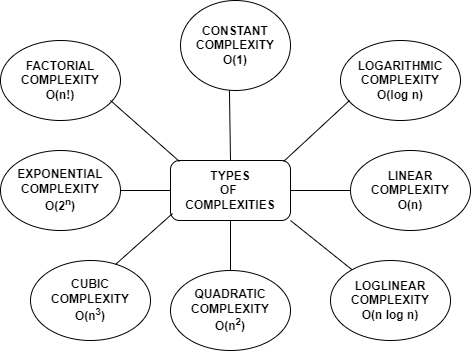
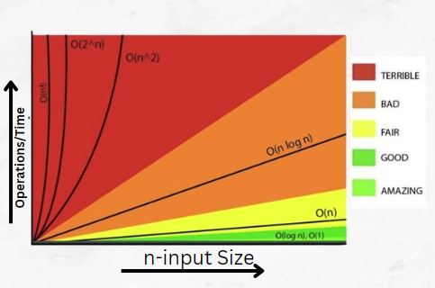

## Different Types of Algorithm Complexity in Data Structure

Algorithm complexity, also known as time complexity, is a measure of the amount of time taken by an algorithm to execute as a function of the input size. The time complexity is typically expressed in terms of the number of operations performed by the algorithm, which can be proportional to the input size, or a function of it. :

1. Constant Time Complexity: An algorithm has a constant time complexity if it takes the same amount of time to execute, regardless of the size of the input. This is denoted by O(1) and is considered the most efficient time complexity. For example, accessing an element in an array by its index takes constant time.

2. Logarithmic Time Complexity: An algorithm has a logarithmic time complexity if the time taken to execute is proportional to the logarithm of the size of the input. This is denoted by O(log n), where n is the size of the input. For example, searching a sorted array using binary search takes logarithmic time, as the algorithm reduces the search space by half at each step.

3. Linear Time Complexity: An algorithm has a linear time complexity if the time taken to execute is proportional to the size of the input. This is denoted by O(n), where n is the size of the input. For example, iterating through an array takes linear time, as the algorithm needs to perform n operations to visit each element.

4. Loglinear Time Complexity: Loglinear complexity is a type of time complexity that arises when an algorithm has a running time that is proportional to the product of the size of the input and the logarithm of the size of the input. Loglinear complexity is denoted by O(n log n), where n is the size of the input.

5. Quadratic Time Complexity: An algorithm has a quadratic time complexity if the time taken to execute is proportional to the square of the size of the input. This is denoted by O(n^2), where n is the size of the input. For example, comparing every pair of elements in an array takes quadratic time.

6. Cubic Time Complexity: Cubic complexity is a type of time complexity that arises when an algorithm has to perform a number of operations that is proportional to the cube of the size of the input. Cubic complexity is denoted by O(n^3), where n is the size of the input.

7. Exponential Time Complexity: An algorithm has an exponential time complexity if the time taken to execute grows exponentially with the size of the input. This is denoted by O(2^n), where n is the size of the input. For example, finding all subsets of an array takes exponential time.

8. Factorial Time Complexity: Factorial complexity is a type of time complexity that arises when an algorithm has to perform a factorial number of operations to solve a problem. A factorial complexity is denoted by O(n!), where n is the size of the input.Factorial complexity is generally considered very inefficient, as it grows very quickly with the size of the input.

It's worth noting that the above types of algorithm complexity are not exhaustive, and there are many other types that can arise depending on the specific algorithm and the problem it is solving. However, understanding these common types can be helpful in analyzing the efficiency of algorithms and choosing the best one for a given problem.
