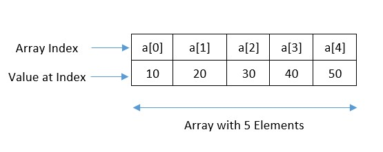
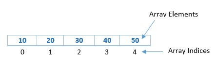
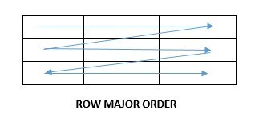
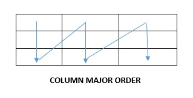

## What are arrays in data structures?

In this tutorial you will learn about the arrays, definition, declaration of array and Initialisation of array with example.

### Definition of Array

An array is a collection of elements of the same data type, stored in contiguous memory locations. Arrays in C are useful when you need to store and manage a large amount of data of the same data type. They enable you to store multiple values in a single variable and simply access and manipulate them using a single variable name and an index.



### Types of Arrays

- One Dimensional Array
- Two Dimensional Array

#### One Dimensional Array

The index of the elements in a 1D array starts from 0.



#### Two Dimensional Array

A two-dimensional (2D) array is a table-like structure that stores data in rows
and columns. The elements are stored in contiguous memory locations
and can be accessed using two indices, one for the row and one for the column.
The index of the elements in a 2D array starts from 0.


#### Memory Representation of Array

The memory representation of an array refers to how the elements
of the array are stored in memory.

The most common way to represent an array in memory is to store
the elements sequentially in a block of memory. For example,
if we have an array of integers a with 5 elements,
the memory representation would look like this:


#### Row Major Order & Column Major Order

There are two main ways to represent an array in memory:
row-major order and column-major order.

###### Row Major Order

In row-major order, the elements of the array are stored row by row in memory.
For example, in a two-dimensional array A[i][j], the elements of the first row are stored first,
followed by the elements of the second row, and so on.
Within each row, the elements are stored in order of increasing column index.
This means that the memory location of an element A[i][j] can be computed as &A[0][0] + i \* n + j,
where n is the number of columns in the array.



###### Column Major Order

In column-major order, the elements of the array are stored column by column in memory.
For example, in a two-dimensional array A[i][j], the elements of the first column are stored first,
followed by the elements of the second column, and so on.
Within each column, the elements are stored in order of increasing row index.
This means that the memory location of an element A[i][j] can be computed as &A[0][0] + j \* m + i,
where m is the number of rows in the array.



The choice of memory representation can have an impact on the performance of array operations.
For example, if a program needs to access all the elements of a row in an array,
it is more efficient to use row-major order because the elements of the row are stored contiguously in memory.
Similarly, if a program needs to access all the elements of a column in an array,
it is more efficient to use column-major order.

In general, the memory representation of an array should be chosen based on the access patterns of the program that uses the array. If the program primarily accesses rows of the array, row-major order should be used, and if the program primarily accesses columns of the array, column-major order should be used.

To access an element in an array, the computer needs to know its memory address.
The memory address of an array element can be calculated using the following formula:

```
address = base_address + index \* size_of_element
```

Where:

- base_address: the memory address of the first element in the array.
- index: the index or subscript of the element you want to access.
- size_of_element: the size (in bytes) of each element in the array.

For example, let's say you have an array of integers with 5 elements and the base address of the array is 100.
The size of each integer element is 4 bytes.
To access the third element a[2] of the array, you would use the following formula:

```
a[2] = 100 + 2 \* 4 = 108
```

So the memory address of the third element in the array is 108.

It's important to note that array indices start at 0, so the first element in the array has an index of 0, the second element has an index of 1, and so on.

###### Address Calculation in Two Dimensional Array

to access an element in a 2D array, the computer needs to know its memory address. The memory address of an element in a 2D array can be calculated using the following formula:

```
address = base_address + (row_index * num_columns + column_index) * size_of_element
```

Where:

- base_address: the memory address of the first element in the 2D array.
- row_index: the index of the row containing the element you want to access.
- column_index: the index of the column containing the element you want to access.
- num_columns: the number of columns in the 2D array.
- size_of_element: the size (in bytes) of each element in the 2D array.

For example, let's say you have a 2D array of integers with 3 rows and 4 columns,
and the base address of the array is 100.
The size of each integer element is 4 bytes.
To access the element at row 1, column 2 which is a[1][2] you would use the following formula:

```
a[1][2] = 100 + (1 _ 4 + 2) _ 4 = 116
```

So the memory address of the element at row 1, column 2 in the 2D array is 116.

It's important to note that row and column indices start at 0,
so the first row and first column in the 2D array have indices of 0,
the second row and second column have indices of 1, and so on.
