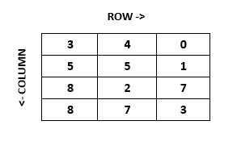
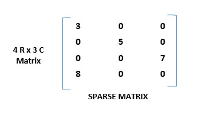
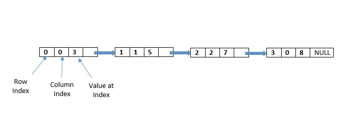

## Sparse Matrix in Data Structure مصفوفة تحتوي على أصفار كثيرة

### What is matrix ?

In computer science, a matrix is a data structure that represents a collection of values arranged in
a two-dimensional grid of rows and columns. Each element in the matrix is identified by its row and
column indices. Matrices are commonly used to represent data in many fields, such as mathematics,
physics, engineering, computer graphics, and machine learning.

A matrix can be represented in many different ways, including using arrays, linked lists, or other
data structures. The most common representation of a matrix is using a two-dimensional array, where
the rows and columns are represented as the first and second indices, respectively. For example, a
matrix with three rows and four columns can be represented as a 3x4 two-dimensional array:

### What is Sparse Matrix?

A sparse matrix is a matrix that contains a large number of zero elements compared to non-zero
elements. In such matrices, it is not efficient to use traditional representations, which store all
elements, because a significant amount of memory will be wasted on storing zero elements. Therefore,
special techniques are used to represent sparse matrices, which can save a lot of memory.

### Representation of Sparse Matirx

Sparse matrices can be represented using both arrays and linked lists. Let's explore both
representations below:

1. Array Representation: In this representation, we use Two-dimensional arrays to store the non-zero
   elements of the sparse matrix. In 2D array representation of sparse matrix, there are three fields
   used that are named as - ROW,COLUMN,VALUE.

2. Linked List Representation: In this representation, we use a linked list to store the non-zero
   elements of the sparse matrix. Each node of the linked list represents a non-zero element and
   contains three fields: the value of the element, the row index of the element, the column index of
   the element and next node to store the address of next node.

#### Array Representation of Sparse Matrix

n the array representation of a sparse matrix, we store only the non-zero elements of the matrix
along with their row and column indices. We use three arrays to represent the sparse matrix:

1. row_index: It stores the row indices of the corresponding elements in the array.

2. col_index:It stores the column indices of the corresponding elements in the array.

3. value : It stores the non-zero elements of the matrix in row-major order.

The size of these arrays depends on the number of non-zero elements in the matrix. Here's an example
of how we can represent a sparse matrix using the array representation:

#### Linked List Representation of Sparse Matrix

A linked list representation of a sparse matrix is a way of storing a matrix that has a large number of zero values efficiently by using linked lists. Each node in the linked list contains the value of the non-zero element, its column index, row index, and a pointer to the next node in the list. This representation reduces the amount of memory required to store the matrix and allows for efficient manipulation of the non-zero elements.

The benefit of using a linked list instead of an array to represent the sparse matrix is that it is simpler to add or remove nodes from a linked list than from an array.

- Row - Row where the non-zero element is located.
- Column - Column where the non-zero element is located.
- Value - It is the value of the non-zero element that is located at the index (row, column).
- Next node - Address of the next node.

