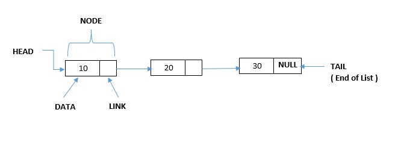
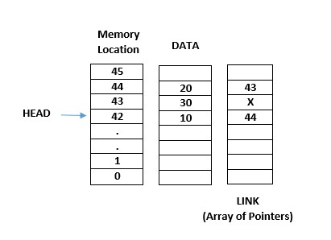
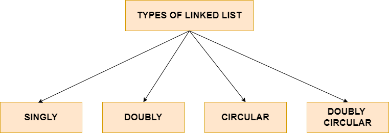
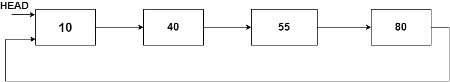
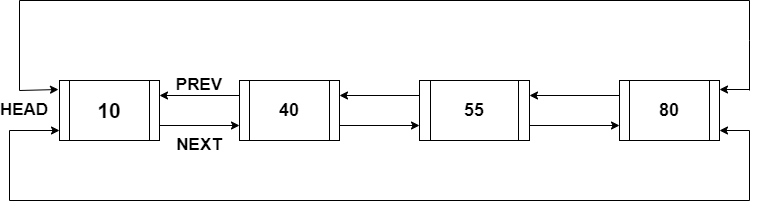

## Linked List Data Structure

A linked list is a fundamental data structure used in computer science to store and manipulate data.
It is a dynamic data structure, which means that its size may be updated during runtime. A linked
list is a sequence of nodes, each node includes data and a reference (or pointer) to the next node in
the sequence.

The first node in the list is known as the head node, and the final node in the list is known as the
tail node. If a node's reference is null, it denotes the end of the list.

The head is the first node in a linked list. It is the starting point for the linked list and
contains a reference to the first element in the list. The data for the first element in the list is
stored in the head node, along with a reference to the next node in the list.

## Advantages of Linked List

Here are some advantages of using linked lists as a data structure:

1. size can be changed at run time. This makes it easier to manage data sets when the number of items changes over time.

2. Efficient Insertions and Deletions: Inserting or deleting an element in an array requires moving all the items to the right or left of the insertion or deletion point. For big arrays, this can be time-consuming. By merely changing the pointers in the relevant nodes, linked lists can insert or remove an element in constant time (O(1)).

3. No Need for Contiguous Memory: There is no need for contiguous memory allocation like arrays, Linked lists, on the other hand, can be built from non-contiguous memory units.

4. Memory efficiency: When the number of items is small or the size of the elements varies, linked lists can be more memory efficient than arrays. This is due to the fact that linked lists only consume the memory necessary for the data and pointers to the next node, but arrays allocate a set amount of memory for each element regardless of whether it is used or not.

5. Flexibility: Linked lists can be singly or doubly linked, and they can be used to build a variety of data structures such as queues, stacks, and hash tables.

Overall, linked lists offer several advantages over other data structures, including efficient insertions and deletions, dynamic size, and flexibility. However, there are also some disadvantages, such as slower access times and the need for more memory due to the additional pointers.

## Disadvantages of Linked List

Here are some disadvantages of using linked lists as a data structure:

1. Slower Access Time: Linked lists do not support constant-time access to individual elements, in contrast to arrays. Instead, you must start at the head node and work your way down the list until you reach the element you need to access in a linked list. If the list is lengthy, this may take longer than accessing an entry in an array.

2. Greater Memory Overhead: When compared to arrays, linked lists use more memory. Linked lists must hold pointers to the following nodes in addition to the data components. This may result in the linked list using more memory, particularly if the list is lengthy.

3. Difficulty in Reversing: Reversal is challenging task in linked lists because it is more difficult to reverse the items in linked list. We have to change the pointers at every node, which can be a challenging and time-consuming task.

4. Difficulty in Accessing Random Elements: Accessing random elements in constant time is not possible with linked lists. You can not access element in linked list by index.

5. No built-in Support for Sorting: Linked lists do not have built-in functionality for sorting. It can take longer to sort a linked list than an array using built-in sorting algorithms. In Linked List we have to arrange all the pointers for sorting. It is very difficult as compared to arrays.

## Memory Representation of Linked List

In most computer languages, linked lists are commonly implemented using pointers. A linked list can also be represented using
arrays, however this is less common. We may use two arrays to represent a linked list with arrays, one for storing the values of
the nodes and another for storing the indices of the next nodes.

- Other way of memory representation of Linked List using arrays.

## Types of Linked List

Linked Lists come in a variety of types, which are listed below:

#### Singly Linked List

Each element (or node) in a singly linked list stores a value and a pointer to the next element (or node) in the list. The first
node is known as the head node, while the last node is known as the tail node.

#### Doubly Linked List

In a Doubly Linked List, each node in a Doubly Linked List has two pointers, one pointing to the next node in the list and the
other referring to the previous node in the list.This allows for easy traversal in both directions.

#### Circular Linked List

In a Circular Linked List, the last node in the list points to the first node, forming a circle. This allows for continuous traversal of the list.

#### Doubly Circular Linked List

Each node in a doubly circular linked list contains two pointers, one pointing to the node before it and the other pointing to
the node after it, creating a circular link between the nodes. In a double circular linked list, the last node points to the
first node, making it circular. Additionally, the first node's previous pointer also points to the last node, making it doubly
linked. This means that elements can be traversed both forward and backward.

## vocabularies

By merely => بمجرد
