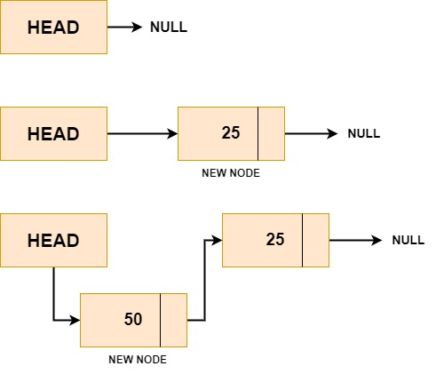

## Linked List Operations

A data structure known as a linked list is made up of a series of elements, each of which points to the element next in the list. The following are the various linked list operations:

- Insertion: To add an element to a linked list, create a new node with the specified value, then place it at the proper location on the list.

- Deletion : Remove the node from the list that has the specified value to delete the element from the linked list.

- Traversal : Traversing a linked list requires iterating over each element in the list and performing some operation on each element.

- Searching : A linked list can be searched by locating the node that holds the specified value, returning that value if it exists, or returning null if it does not.
  Concatenation : Concatenation is the process of joining the two linked lists to form a single, longer linked list.

- Splitting : Splitting involves separating a linked list into two separate lists at a specific position.

- Reversal : If you want to reverse the order of elements in the Linked list then it involves changing its elements' positions so that the last element becomes the first element and first element becomes last element..

- Sorting : Sorting a linked list means placing the elements in the list in some given order, such as ascending or descending order.

- Merging : Merging two sorted linked lists means combining the two lists into a single, sorted linked list.

- Counting : Counting the number of elements in a linked list involves iterating over each element in the list and incrementing a counter variable for each element found.

## Insertion in Linked List

Here are three cases of new node insertion in a linked list:

1. Insertion at the beginning of the linked list: In this case, the new node is inserted at the beginning of the linked list, which becomes the new head node. This can be done by setting the next pointer of the new node to point to the current head node and updating the head pointer to point to the new node.

2. Insertion at the end of the linked list: In this case, the new node is inserted at the end of the linked list, which becomes the new tail node. This can be done by traversing the linked list till the last node and setting the next pointer of the last node to point to the new node.

3. Insertion at a specific position in the linked list: In this case, the new node is inserted at a specific position in the linked list, which involves traversing the linked list till the desired position and inserting the new node there. This requires keeping track of the previous node and updating its next pointer to point to the new node, while setting the next pointer of the new node to point to the next node.

#### Insertion at the beginning of the linked list

To insert a new element at the beginning of a linked list, we need to create a new node, set its value to the new element, and then update the head of the linked list to point to the new node.

Algorithm to Insert New Node at Beginning in Linked List
Here ITEM is the value we want to insert in the node.

```
Step 1: IF NEWNODE= NULL
            Write OVERFLOW
            Go to Step 5
            [END OF IF]

Step 2: SET NEWNODE → DATA = ITEM
Step 3: SET NEWNODE → NEXT = HEAD
Step 4: SET HEAD = NEWNODE
Step 5: EXIT
```


