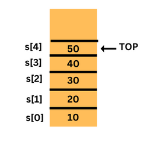
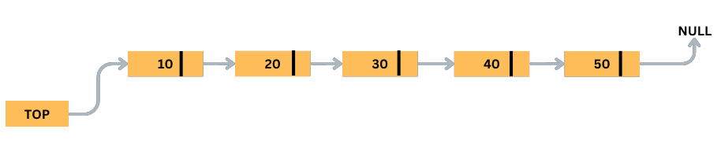
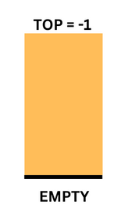
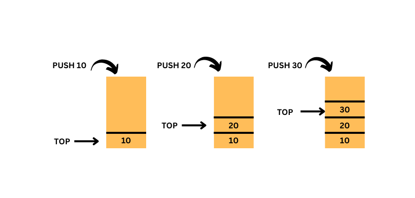
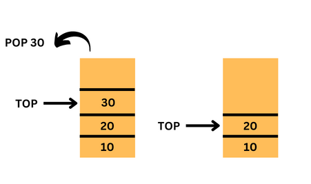

## Stack Data Structure

In this Tutorial,you will learn about

- What is Stack Data Structure?
- Memory Representation of Stack using Arrays and Linked List
- Working of Stack
- Basic Operations in Stack
- Algorithm and Program of PUSH operation in Stack
- Algorithm and Program of POP operation in Stack

#### What is Stack Data Structure?

A stack is a linear data structure that follows the Last-In-First-Out (LIFO) principle, where the element that is inserted last will be the first to be removed.

A stack has one end, typically called the top, and it can be visualized as a collection of objects stacked one on top of another. The top of the stack is the element that was most recently added, and the bottom of the stack is the element that was added first or the earliest.

The top of the stack is represented using a pointer, called the top pointer, which points to the last element inserted. When a new element is added to the stack, it is placed on the top of the stack, and the top pointer is updated to point to the new element.

In a stack, elements are added and removed from the top of the stack using push and pop operations, respectively. The top pointer points to the last element inserted, and when an element is added to the stack, the top pointer is updated to point to the new element. When an element is removed from the stack, the top pointer is moved to the next element below the top, which becomes the new top of the stack.

#### Memory Representation of Stack

In computer science, a stack is an abstract data type that represents a collection of elements with a Last-In-First-Out (LIFO) ordering. A stack can be implemented using an array or a linked list. In both cases, memory is used to store the stack elements and manage the stack operations.

Here's a brief overview of the memory representation of stacks:

1. Memory Representation of Stack using Arrays: In an array-based stack, the stack elements are stored in a contiguous block of memory, typically an array. The stack pointer points to the topmost element of the stack, and the stack operations modify the stack pointer and the elements in the array. When the stack size is fixed, the array-based stack can overflow or underflow, causing memory access errors.

Memory Representation of Stack using Arrays

2. Memory Representation of Stack using Linked List: In a linked list-based stack, the stack elements are stored in individual nodes, each with a pointer to the next node. The stack pointer points to the head node of the linked list, and the stack operations modify the stack pointer and the links between the nodes. When the stack size is dynamic, the linked list-based stack can allocate or deallocate memory as needed, avoiding overflow or underflow errors.

#### Working of Stack

A stack is a data structure that stores elements with a Last-In-First-Out (LIFO) ordering. It works by using a stack pointer to manage the insertion and removal of elements from the top of the stack.

Pushing 10, 20, and 30 onto the stack will result in the stack [10, 20, 30] with the top pointer pointing to the element 30. Performing pop operations on the stack will remove elements from the top of the stack and decrement the top pointer accordingly, eventually leaving an empty stack with a null top pointer.

#### Basic Operations in Stack

The basic operations of a stack are given below:

1. Push: The push operation adds an element to the top of the stack. For example, if we have a stack containing [10, 20], and we perform the push operation with the value 30, the resulting stack will be [10, 20, 30], with the top element being 30.

2. Pop: The pop operation removes the topmost element from the stack. For example, if we have a stack containing [10, 20, 30], and we perform the pop operation, the resulting stack will be [10, 20], with the top element being 20.

3. Peek: The peek operation allows you to view the topmost element of the stack without removing it. For example, if we have a stack containing [10, 20, 30], and we perform the peek operation, the top element will be returned, which is 30, but the stack will remain unchanged.

4. isEmpty: The isEmpty operation checks whether the stack is empty or not. It returns true if the stack is empty and false if it contains one or more elements. For example, if we have an empty stack, and we perform the isEmpty operation, it will return true.

5. Size: The size operation returns the number of elements in the stack. For example, if we have a stack containing [10, 20, 30], and we perform the size operation, it will return 3.

6. Search: The search operation allows you to search for a specific element in the stack and returns its position (counting from the top of the stack). If the element is not found in the stack, it returns -1. For example, if we have a stack containing [10, 20, 30], and we perform the search operation with the value 20, it will return 2 (since 20 is the second element counting from the top of the stack).

7. Updation: The update operation allows you to modify the value of an existing element in the stack. This operation involves first searching for the element in the stack, and then replacing its value with a new value.

8. Clear: The clear operation removes all elements from the stack, leaving it empty. For example, if we have a stack containing [10, 20, 30], and we perform the clear operation, the resulting stack will be empty, and the top pointer will be null or -1.
