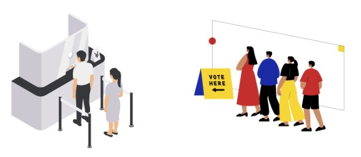
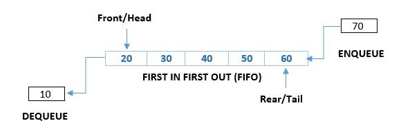
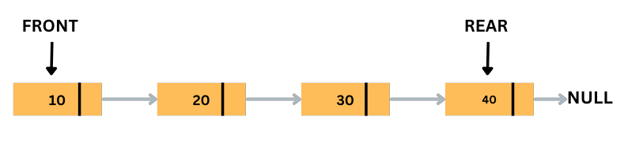

## Introduction to Queues

A queue is a data structure in computer science that stores elements in a linear sequence, similar to a stack. However, unlike a stack, elements in a queue are added to the back and removed from the front. This ordering principle is often referred to as "first-in, first-out" (FIFO).

Examples of Queue

FIFO stands for "first-in, first-out", which is a principle used in various areas of computer science and everyday life. The principle is simple - the first item that enters a queue is the first one to be removed from it. It means that items in a queue are processed or served in the order that they arrive.

#### Memory Representaion of Queue

Array and linked list representations of a queue:

1. Array representation of a queue: In this representation, a queue is implemented using a fixed-size array. The front and rear of the queue are represented by two pointers, front and rear respectively. When a new element is added to the queue, it is inserted at the rear end, and the rear pointer is incremented. Similarly, when an element is removed from the queue, it is removed from the front end, and the front pointer is incremented.

The array representation of a queue is simple and efficient, but it has a fixed size and may require resizing if the queue exceeds its capacity.

2. Linked list representation of a queue: In this representation, a queue is implemented using a linked list. Each node in the linked list contains an element and a pointer to the next node. The front and rear of the queue are represented by two pointers, front and rear respectively, which point to the first and last nodes of the linked list. When a new element is added to the queue, it is added to the rear end of the linked list, and the rear pointer is updated to point to the new node.

Similarly, when an element is removed from the queue, it is removed from the front end of the linked list, and the front pointer is updated to point to the next node. The linked list representation of a queue is flexible and dynamic, but it requires more memory allocation and deallocation than the array representation.

Overall, both array and linked list representations of a queue have their advantages and disadvantages. The choice between them depends on the specific requirements of the application, such as memory usage, speed, and flexibility.

### Basic Operations on Queue

- Traversal : Traversal is the process of visiting and processing each element of a data structure. In the context of queues, traversal means visiting and processing each element in the queue.

- Insertion or Enqueue : To add a new element or node in the queue..

- Deletion or Dequeue : To delete a element or node from the queue.

- Searching : To search an element(s) by value in the queue.

- Updating : To update a particular value in the queue.

- Sorting: To arrange value in the queue in ascending or descending order.

- Merging: To merge two Queues into one.

#### Applications of Queue

Some of the applications of queues include:

1. Operating systems: Operating systems use queues to manage resources such as CPU time, memory, and input/output devices. For example, when multiple processes are competing for CPU time, the operating system uses a queue to schedule each process in a fair and efficient manner.

2. Network routing: In computer networks, packets of data are sent from one device to another. Queues are used to manage the flow of these packets, ensuring that they are delivered in the correct order and without delay. For example, when packets arrive at a router, they are placed in a queue and processed in the order they were received.

3. Customer service: Many businesses use queues to manage customer service requests. For example, when customers call a support hotline, their requests are placed in a queue and processed in the order they were received. This ensures that all customers are served fairly and efficiently.

4. Print spooling: When multiple users want to print a document, they are placed in a queue and processed in the order they were received. This ensures that each user's document is printed in turn and that no user monopolizes the printer.

5. Call centers: When customers call a call center, their calls are placed in a queue and handled by an available agent. This ensures that all customers are served in the order they called and that no calls are lost or ignored.

6. Task scheduling: In software development, queues are used to schedule tasks such as database updates, report generation, and file processing. For example, a web application might use a queue to handle requests for generating reports. Each request is placed in the queue and processed in the order it was received.
