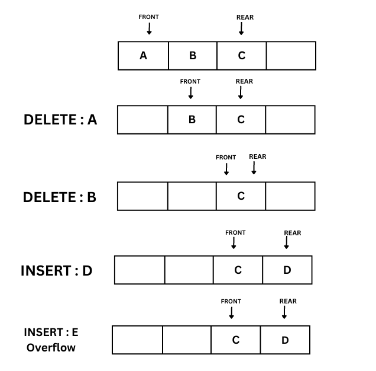

## Circular Queue

In this tutorial,you will learn the followings

- What is the need for a Circular Queue?
- What is Circular Queue?
- Basic Operations of Circular Queue
  <!-- Algorithm to insert new element in a Circular Queue -->
  <!-- Algorithm to delete element from a Circular Queue -->

#### What is the need for a Circular Queue?

To understand the need for Circular queue first try to understand the limitation or disadvantages of simple queue. Consider an example where the size of the queue is four elements. Initially the queue has 3 elements A,B and C. It is requested to delete A and B and insert D and E. Note that an overflow occurs on trying to insert E even though the first two locations are empty. This is the main limitation or disadvantage of simple queue.

#### What is Circular Queue?

A circular queue is a data structure that represents a queue of elements in a circular manner, allowing the insertion and deletion of elements at both ends of the queue. It is also known as a ring buffer. In a circular queue, the elements are stored in a circular manner, with the first and last elements adjacent to each other.

The key advantage of a circular queue over a regular queue is that it can reuse the empty space created by removing elements from the front of the queue.The circular queue can be implemented using an array or a linked list data structure, with a front and rear pointer to keep track of the start and end of the queue.

#### Basic Operations of Circular Queue

- Enqueue: Adding an element to the back of the circular queue. This operation is also called "Insert" or "Push".

- Dequeue: Removing an element from the front of the circular queue. This operation is also called "Delete" or "Pop".

- Front: Return the element at the front of the circular queue without removing it.

- Rear: Return the element at the back of the circular queue without removing it.

- isEmpty: Check if the circular queue is empty or not.

- isFull: Check if the circular queue is full or not.

- Size: Return the number of elements present in the circular queue.

- Clear: Empty the entire circular queue by removing all the elements.
