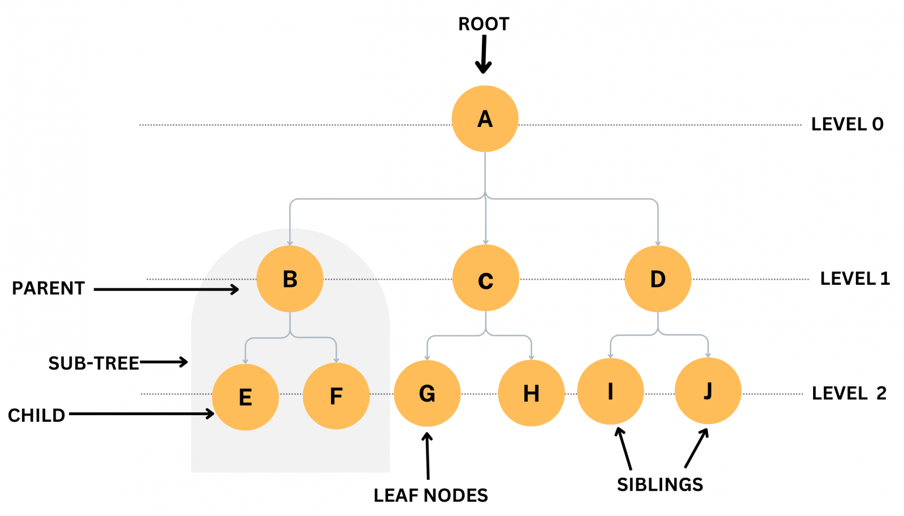
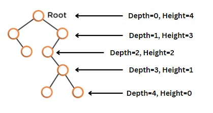
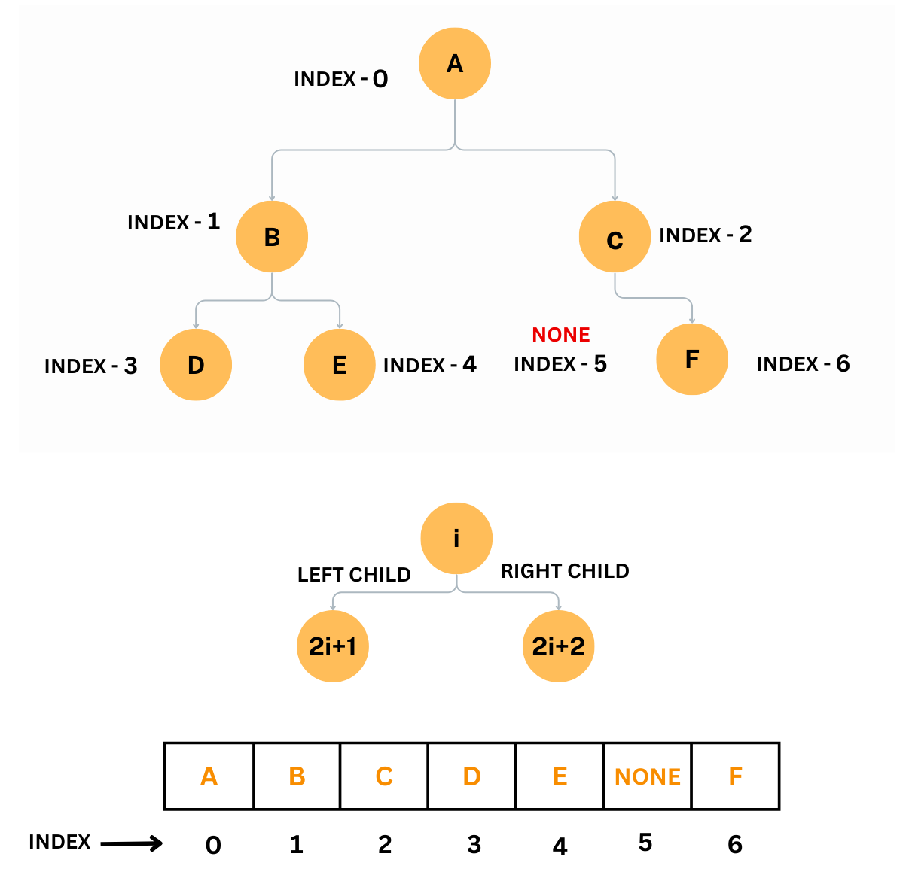
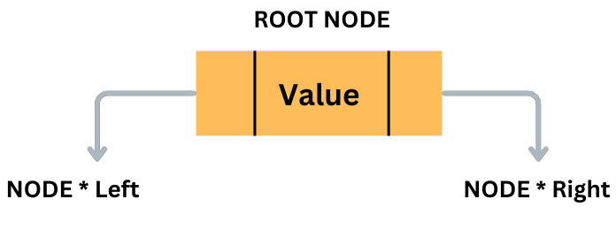
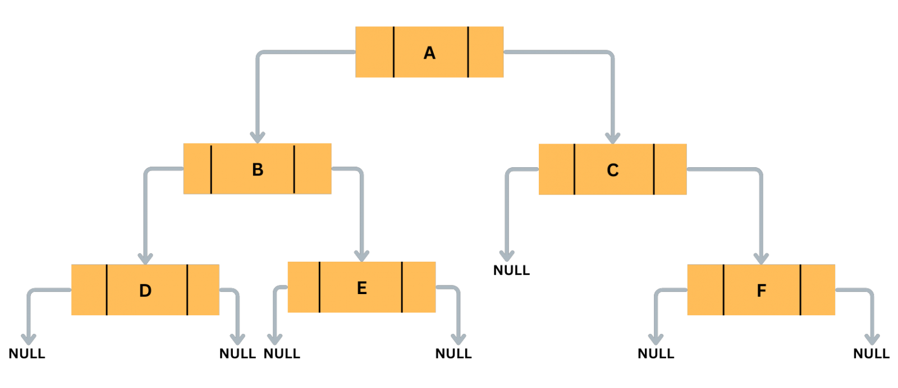

# Basic Concepts of Tree in Data Structure

In this tutorial, you will learn the followings

- What is Tree Data Structure?

- Basic Terminology of Tree Data Structure

- Memory Representation of Tree using Array and Linked List

## What is Tree Data Structure ?

A tree is a non-linear data structure consisting of nodes connected by edges. It is used to represent hierarchical structures, such as file systems, computer directories, and organization charts. Trees are a fundamental data structure used in computer science, and they have many applications, such as in search algorithms, decision-making processes, and data compression.

A tree is composed of nodes, which are connected by edges. The topmost node in a tree is called the root node, which has no parent nodes. Each node in a tree can have one or more child nodes, except for the leaf nodes, which have no children. Nodes that share the same parent node are called siblings.

There are different types of trees, and they have different characteristics and properties. Some of the common types of trees are binary trees, binary search trees, balanced trees, AVL trees, and Red-Black trees.

## Basic Terminology of Tree Data Structure

The terminology used in trees includes the following:

1. Root: The topmost node in a tree, which has no parent nodes.

2. Parent: A node that has one or more child nodes.

3. Child: A node that has a parent node.

4. Siblings: Nodes that have the same parent node.

5. Leaf: A node with no children.

6. Depth or Level: The depth(or level) of a node is equal to the number of edges from tree's root node.

7. Height: The height of the node is the length of the path from that node to the deepest node in the tree.

8. Subtree: A tree that consists of a node and all its descendants.

The depth and height of a tree are two important concepts in the study of trees.

The depth of a node is the number of edges from the root node to that node. The depth(or level) of a node is equal to the number of edges from tree's root node. The depth of the root node is 0.

The height of a node is the number of edges from that node to the furthest leaf node. In other words, it is the length of the longest path from the node to a leaf node. The height of a leaf node is 0.

## Memory Representation of Tree Data Structure

A tree is a data structure that consists of nodes connected by edges. Each node in a tree has a parent node and zero or more child nodes.

There are two common ways to represent a tree in computer memory: using an array or using a linked list.

#### Memory Representation of Tree Using Array

In an array representation of a tree, the nodes are stored in an array. The root node is stored at index 0, and the child nodes of each node are stored at indices that can be calculated based on the index of the parent node. Specifically, if a node is stored at index i, its left child is stored at index 2i+1 and its right child is stored at index 2i+2.

For example, consider the following tree:

In the array representation, the tree would be stored as:

The root node 'A' is stored at index 0, its left child 'B' is stored at index 1 (using 2i+1) , and its right child 'C' is stored at index 2 (using 2i+2). The left child of 'B', 'D', is stored at index 3, and the right child of 'B', 'E', is stored at index 4. The left child of 'C', None, indicates that it has no left child, and its right child 'F' is stored at index 6.

#### Memory Representation of Tree Using Linked List

In a linked list representation of a tree, each node is stored in a struct or class that contains a value and two pointers to its left and right child nodes. The root node is a pointer to the first node in the list.

For example, Consider the following linked list representation of Tree.

The linked list representation of a tree can be implemented in different ways. One common way is to use a Node class or struct to represent each node in the tree. Each Node object contains the value of the node and two pointers to its left and right child nodes.
