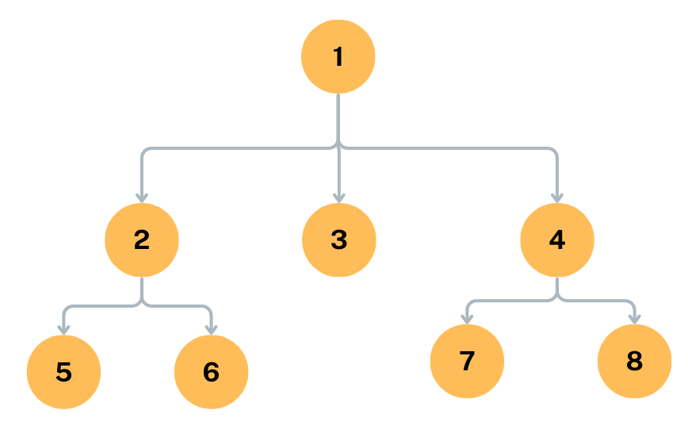
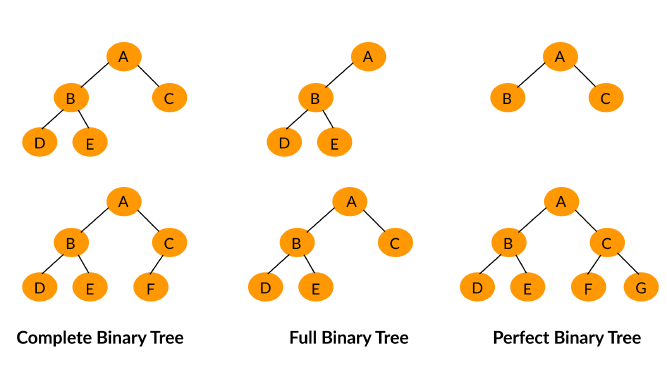
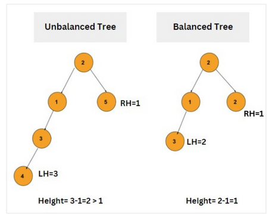
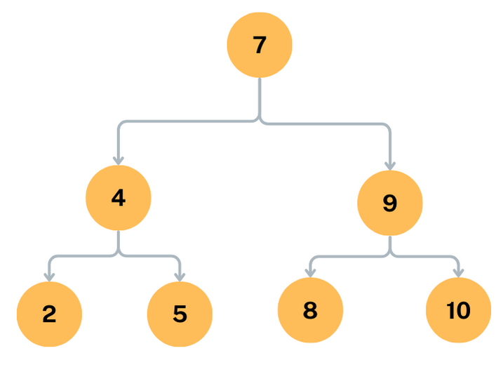

# Binary Tree

In this tutorial, you will learn the followings:

- What is Binary Tree in Data Structure?

- Types of Binary Tree

- Characteristics of Binary Tree

- Binary Tree Traversal

## What is Binary Tree in Data Structure?

A binary tree is a type of data structure used in computer science for organizing and storing data. It consists of nodes, where each node has a value and each node can have a degree equal to or less than two.

In a binary tree, the left child node always has a value less than or equal to its parent node, while the right child node always has a value greater than or equal to its parent node. This property makes binary trees useful for searching and sorting data efficiently.

To satisfy the definition of a binary tree, a tree must meet the following conditions:

1. Each node can have at most two children: A binary tree is a tree data structure in which each node has at most two child nodes. This means that a node can have either zero, one, or two children.

2. The left child is less than the parent, and the right child is greater than the parent: In a binary search tree, the values of the nodes in the left subtree are less than the value of the parent node, while the values of the nodes in the right subtree are greater than the value of the parent node.

3. The tree is a connected graph: A binary tree is a connected graph, which means that there is a path from any node to any other node in the tree.

4. The tree has a unique root node: A binary tree has a unique root node, which is the topmost node in the tree.

5. Each child node has its own subtree: Each node in a binary tree has its own subtree, which is a subtree that includes all the nodes that are descendants of the node.

6. The tree is acyclic: A binary tree is acyclic, which means that there are no cycles in the tree.

7. The tree may be empty: A binary tree may be empty, which means that it has no nodes.


in above example the tree is a binary tree



In the above example Tree is not a Binary Tree, because root node having three childs.

Binary trees can be implemented in many different ways, including arrays and linked lists. One common way to implement a binary tree is to use a linked list, where each node in the tree points to its left and right child nodes.

## Types of Binary Tree

There are several types of binary trees, some of the common types are:



1. Complete Binary Tree: A complete binary tree is a binary tree in which every level, except possibly the last, is completely filled, and all nodes are as far left as possible.

2. Full Binary Tree: A full binary tree is a binary tree in which every node has either 0 or 2 children. In other words, every node in the tree has either two child nodes or no child nodes.

3. Perfect Binary Tree: A perfect binary tree is a type of binary tree in which all the leaf nodes are at the same level, and all the internal nodes have exactly two child nodes. This means that each level of the tree is completely filled, and the total number of nodes in the tree is a power of two.

## Characteristics of Binary Tree

Binary trees have several important characteristics and properties. For example:

1. Height: The height of a binary tree is the number of edges from the root node to the deepest leaf node.

2. Depth: The depth of a node is the number of edges from the root node to that node.

3. Balanced vs. Unbalanced: A binary tree is said to be balanced if the heights of its left and right subtrees differ by 1. If the heights of the subtrees differ by more than one, the tree is said to be unbalanced.



4. Traversals: Binary trees can be traversed in several different ways, including inorder, preorder, and postorder. Inorder traversal visits the left subtree, then the root, and then the right subtree. Preorder traversal visits the root, then the left subtree, and then the right subtree. Postorder traversal visits the left subtree, then the right subtree, and then the root.

## Binary Tree Traversal

Binary tree traversal is the process of visiting each node in a binary tree exactly once in a systematic order. There are three main ways to traverse a binary tree: inorder traversal, preorder traversal, and postorder traversal.

1. Inorder traversal: In inorder traversal, we first visit the left subtree, then the root node, and finally the right subtree. This traversal results in the nodes being visited in ascending order.

2. Preorder traversal: In preorder traversal, we first visit the root node, then the left subtree, and finally the right subtree.

3. Postorder traversal: In postorder traversal, we first visit the left subtree, then the right subtree, and finally the root node.

Traversal is a fundamental operation in working with binary trees, as it allows us to process all the nodes in the tree in a specific order. Binary tree traversal algorithms are widely used in many applications, including search algorithms, sorting algorithms, and tree-based data structures.

### Inorder Traversal

Inorder traversal is a method of visiting every node in a binary tree in a specific order. In inorder traversal, we first visit the left subtree, then the root node, and finally the right subtree. This traversal results in the nodes being visited in ascending order.

Here's an example:


In inorder traversal, we visit the nodes in the order: 2, 4, 5, 7, 8, 9, 10.

In this example, we first visit the left subtree of node 7, which consists of the nodes 2, 4, and 5. We then visit the root node 7, followed by the right subtree, which consists of the nodes 8, 9, and 10.

#### Algorithm for Inorder Traversal using Recursion

Here R is the Pointer variable gives the address of root node.

```
INORDER(R)

Step 1: If R == NULL   (Is Tree Empty)

             Exit

Step 2 : If  R-> LEFT != NULL then  ( Traverse the Left Subtree)

              Call INORDER(R-> LEFT)

Step 3 : Write  R -> INFO

Step 4 : If R -> RIGHT != NULL then   ( Traverse the Right Subtree)

              Call INORDER(R -> RPTR)

Step 5 : Exit
```

### Preorder Traversal

Preorder traversal is a method of visiting every node in a binary tree in a specific order. In preorder traversal, we first visit the root node, then the left subtree, and finally the right subtree.

- Root Node
- left Subtree
- Right Subtree

Here's an example:



In preorder traversal, we visit the nodes in the order: 7, 4, 2, 5, 9, 8, 10.

In this example, we first visit the root node 7, followed by the left subtree of node 7, which consists of the nodes 4, 2, and 5. We then visit the right subtree of node 4, which consists of the nodes 9, 8, and 10.

#### Algorithm for Preorder Traversal using Recursion

```
PREORDER(R)

Step 1: If R == NULL   (Is Tree Empty)

             Exit

Step 2 : Write  R -> INFO

Step 3 : If  R-> LEFT != NULL then  ( Traverse the Left Subtree)

              Call  PREORDER(R-> LEFT)

Step 4 : If R -> RIGHT != NULL then   ( Traverse the Right Subtree)

              Call  PREORDER(R -> RPTR)

Step 5 : Exit
```

### Postorder Traversal

Postorder traversal is a method of visiting every node in a binary tree in a specific order. In postorder traversal, we first visit the left subtree, then the right subtree, and finally the root node.

- Left Subtree (Visit the Left Child First)
- Right Subtree
- Root Node

Here's an example:


In postorder traversal, we visit the nodes in the order: 2, 5, 4, 8, 10, 9, 7.

In this example, we first visit the left subtree of node 7, which consists of the nodes 2, 4, and 5. We then visit the right subtree of node 4, which consists of the nodes 8, 9, and 10, before finally visiting the root node 7.

Postorder traversal is often used to delete a binary tree, as it visits the children before the parent nodes. It is also a fundamental operation in working with binary trees, as it allows us to process all the nodes in the tree in a specific order.

#### Algorithm for Postorder Traversal using Recursion

Here R is the Pointer variable gives the address of root node.

```
POSTORDER(R)

Step 1: If R == NULL   (Is Tree Empty)

             Exit

Step 2 : If  R-> LEFT != NULL then  ( Traverse the Left Subtree)

              Call POSTORDER(R-> LEFT)


Step 3 : If R -> RIGHT != NULL then   ( Traverse the Right Subtree)

              Call POSTORDER(R -> RPTR)

Step 4 : Write  R -> INFO

Step 5 : Exit
```
