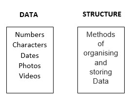

## Introduction to Data Structure

The name "Data Structure" is a combination of two words: "Data" and "Structure". Let's go over each word individually:

- Data: Data is information that must be processed and stored in a computer. Data can be anything from numbers to characters to dates to photos to videos.

- Structure: Structure refers to how data is structured. It specifies the relationship between various data elements and how they are kept in memory. The structure has an impact on the efficiency of data operations.

A data structure is a systematic way of storing and managing data in a computer so that it can be retrieved and used efficiently.

## What is Data Structure?

A data structure is a method of organising and storing data in a computer in order for it to be retrieved and used efficiently. The desire to manage massive volumes of data effectively leads to the need for data structures. This can be achieved by structuring data in a way that makes operations like search, insertion, and deletion easier. Data structures give a framework for organising and manipulating data, making information management and analysis easier. They also enable the development of efficient data-processing algorithms, allowing difficult issues to be solved in a reasonable amount of time.

## Why we should learn Data Structures?

There are various reasons why learning data structures is important:

- Problem Solving: Data structures are an important tool for handling many real-world problems. Understanding data structures can help you build more efficient and effective programs.

- Algorithm Design: To store and modify data, many algorithms rely on data structures. A solid understanding of data structures is required for the development of effective algorithms.

- Requirements for the Job: Data structure knowledge is frequently required for software engineering and computer science employment. Candidates with a thorough understanding of data structures and algorithms are highly valued by employers.

- Competitive Programming: Data structure knowledge is essential for competitive programming and coding competitions.
- Better Understanding of Computer Science: Data structures are a fundamental concept in computer science and understanding them can deepen your overall understanding of the field.

In summary, learning data structures is important for problem-solving, algorithm design, job requirements, competitive programming, and gaining a better understanding of computer science.

## What is the need of Data Structure?

Some specific reasons why data structures are important include:

- Improved Time Complexity: Using appropriate data structures can lead to better time complexity, making it possible to solve problems more quickly. For example, searching for an element in a sorted array is faster than searching for it in an unsorted array.

- Better Space Complexity: Data structures can help to reduce the amount of memory needed to store data. For example, using a linked list instead of an array can reduce the amount of memory needed to store the same data.

- Efficient Data Retrieval: Data structures make it easier to retrieve specific data efficiently. For example, a hash table can retrieve data in constant time, while searching through an unsorted array takes linear time.

- Better Data Management: Data structures make it easier to manage and manipulate data. For example, a stack can be used to implement an undo functionality in an application.

- Solving Complex Problems: Data structures can provide the foundation for efficient algorithms, making it possible to solve complex problems in a reasonable amount of time. For example, graph algorithms can be used to find the shortest path between two points or to find the minimum spanning tree of a graph.

In summary, data structures play a crucial role in solving problems related to data management and analysis by providing efficient solutions for organizing, retrieving, and manipulating data.

## Characteristics of Data Structure

The following are some of the main characteristics of data structures:

Representation of Data: Data structures define a way of representing data in a computer's memory, making it possible to store, manipulate, and access data efficiently.

- Access Techniques: Different data structures provide different techniques for accessing data stored within them, such as random access or sequential access.

- Storage Organization: Data structures define the organization of data in memory, such as linear or hierarchical organization.

- Insertion and Deletion Operations: Different data structures support different methods for adding and removing elements, such as insertion at the end or deletion from the front.

- Time and Space Complexity: Data structures can have different time and space complexities, depending on the operations they support and the way they organize data.

- Adaptability: Some data structures are more adaptable to certain types of data and operations than others. For example, a stack is more suitable for problems that require Last-In-First-Out (LIFO) behavior, while a queue is better suited for problems that require First-In-First-Out (FIFO) behavior.

- Flexibility: Different data structures have different degrees of flexibility, such as the ability to dynamically grow or shrink in size, or the ability to efficiently insert or delete elements in the middle.

In summary, these are some of the key characteristics of data structures that affect their efficiency, suitability, and versatility for different types of problems and applications.

## Advantages of Data Structure

- Better Data Organization: Data structures provide a way of organizing data in a meaningful and efficient manner, making it easier to access and manipulate data. ( repeated )

- Increased Data Retrieval Efficiency: Data structures can provide fast and efficient retrieval of data, which is essential in many real-world applications. ( repeated )

- Efficient Data Manipulation: Data structures can provide efficient methods for adding, deleting, and modifying data, which is important in dynamic applications. ( repeated )

- Improved Code Reusability: Reusable data structures can be used in many different applications, reducing the time and effort required to write and maintain code.

- Better Problem-Solving Capability: Data structures provide a way of modeling real-world problems and solving them in a more efficient and elegant manner. ( repeated )

- Reduced Memory Requirements: Data structures can be designed to use memory more efficiently, reducing the overall memory requirements of an application. ( repeated )

- Increased Data Security: Data structures can be designed to provide additional security features, such as data encryption and protection against unauthorized access.

In summary, data structures play a crucial role in many real-world applications, providing numerous benefits in terms of data organization, retrieval efficiency, manipulation, code reusability, problem-solving capability, memory utilization, and data security.

## Vocabulary

systematic way -> طريقة منهجية ومدروسة
thorough -> شامل

## resources

[techskillguru](https://techskillguru.com/ds/introduction-to-ds)
