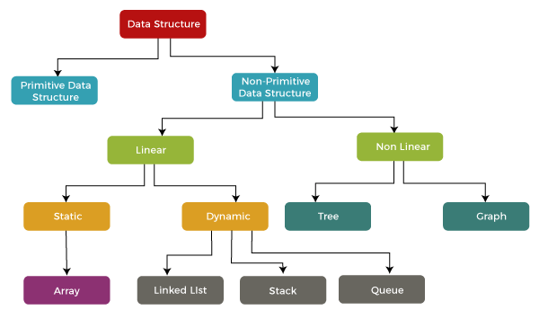

### Types of Data Structure

A data structure is a way of organizing, storing, and manipulating data in a computer so that it can be efficiently used and retrieved. Data structures can be classified into two categories: Primitive and Non-Primitive.

### Primitive Data Structures

- These are the most basic and fundamental data structures, such as integers, floats, and Booleans, that are directly built into a programming language. They have a clear and straightforward representation and are functionally constrained.

Here are a few points about Primitive Data Structures:

1. Basic: Primitive data structures are the most basic and fundamental data structures that are directly built into a programming language.

2. Simple Representation: They have a simple and straightforward representation, such as integers, floating-point numbers, and Booleans.

3. Limited Functionality: Primitive data structures are limited in their functionality and can only store and manipulate simple data.

4. Built-in Types: Primitive data structures are typically built-in types in most programming languages and do not require any special implementation.

5. Fast Access: Primitive data structures are stored in contiguous memory locations, which allows for fast access to their elements.

6. Efficient Storage: Since primitive data structures have a simple representation, they use less memory compared to non-primitive data structures.

7. Commonly used: Primitive data structures are commonly used in programming to store basic information and are used as building blocks for more complex data structures.

### Non Primitive Data Structures

- These are more advanced and complex data structures that are built using primitive data structures. Arrays, linked lists, trees, graphs, and hash tables are some examples. They offer more advanced functionality and allow us to use the efficient storing and manipulation of large volumes of data. They are used to handle complex problems that primitive data structures alone cannot solve.

Here are a few points about Non-Primitive Data Structures:

1. Complex: Non-primitive data structures are more complex and sophisticated data structures that are built using primitive data structures.

2. Advanced Functionality: They provide more advanced functionality and enable the efficient storage and manipulation of large amounts of data.

3. Used to solve complex problems: Non-primitive data structures are used to solve complex problems that cannot be solved using primitive data structures alone.

4. Dynamic: Non-primitive data structures can grow or shrink in size during runtime, whereas primitive data structures have a fixed size.

5. More Memory: Non-primitive data structures use more memory compared to primitive data structures due to their complex representation.

6. Higher Abstraction: Non-primitive data structures provide a higher level of abstraction compared to primitive data structures and hide the underlying implementation details.

7. Efficient Access: Non-primitive data structures are designed to provide efficient access to elements based on the problem they are used to solve.

- Non-Primitive Data Structures are more complex data structures built using primitive data structures. Examples of Non-Primitive Data Structures can be divided into two categories: Linear and Non-Linear.

1. Linear Data Structures: These data structures are organized in a linear or sequential manner. Examples include: Array,Linked List, Queue,Stack

2. Non-Linear Data Structures: These data structures are not organized in a sequential or linear manner. Examples include: Trees and Graphs

### resources

[techskillguru](https://techskillguru.com/ds/types-of-data-structure)
